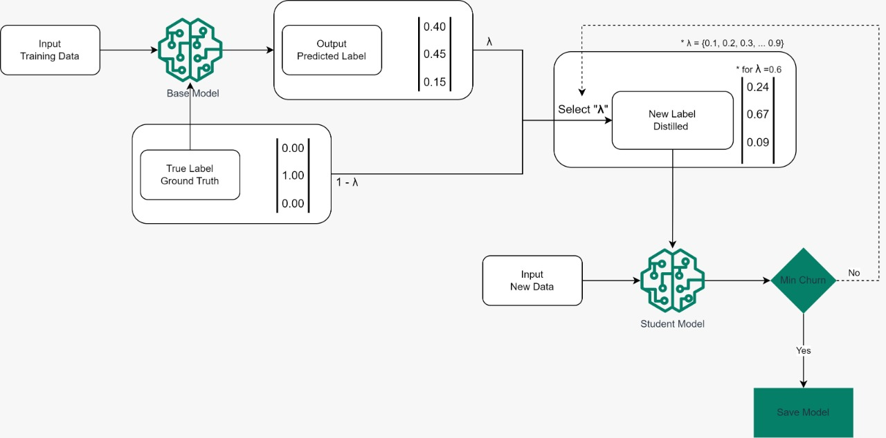
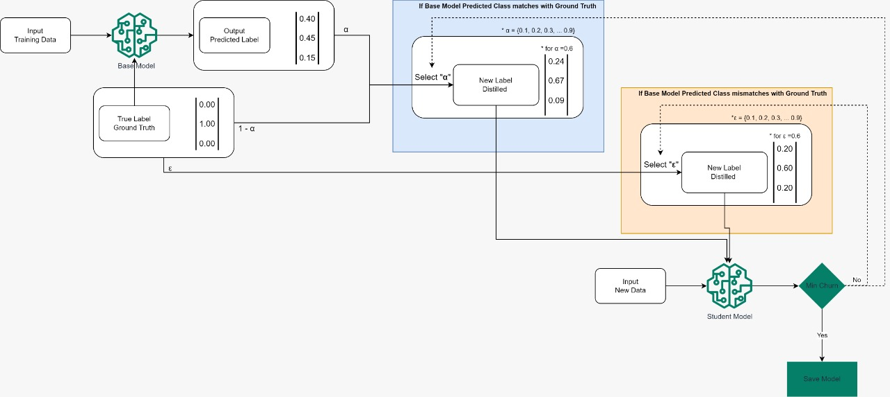

# Prediction Churn Reduction

## Table of content
1. [Motivation](#Motivation)
2. [Methods](#Methods)  
   2.1 [Knowledge Distillation](#Distillation)  
   2.2 [Anchor Method](#Anchor)  
3. [Milestones](#Milestones)
4. [Experiments](#Experiments)  
   4.1. [Experiment setup](#Experiment setup)  
   4.2. [Metrics](#Metrics)  
   4.3. [Models](#Models)  
   4.4. [Results](#Results)  
5. [Package](#Package)
6. [Resources](#Resources)  
7. [Contributors](#Contributors)

## Motivation <a name="Motivation"></a>
It is hard to imagine the modern world without machine learning algorithms, which are used ubiquitously in many industries. For instance, banks use predictive algorithms to score their clients and assess risks. IT giants such as Google and Amazon use complex Deep Neural Networks as essential components of their services - Google Translate, Alexa, Google Photos, self-driving cars, and others. As our lives become more digital, cybersecurity becomes more necessary. An extremely flexible tool, machine learning is used in many different contexts, from simple spam filters to sophisticated methods to detect suspicious activity, spotting attacks, and blocking any malicious intent. There are many reasons why machine learning and deep learning are successful in such a dynamic field: automated algorithms are better adapted for rapid changes than heuristic expert-driven approaches, scalability, and it is easier and faster to tune a machine learning algorithm than to develop a brand new set of rules.  

Despite the obvious usefulness of machine learning algorithms, many challenges persist. One such challenge is prediction churn. Prediction churn is the discrepancy between the predictions made by the same model trained on different data samples and is defined as a proportion of mismatched data points to the number of overall predictions. Churn inevitably occurs during the iterative lifecycle of any predictive algorithm. However, mismatches may create many problems for the end users and can be detrimental for businesses that use such algorithms. As an illustration, Google faced backlash when its image classification system first identified photos as trees but then classified them as cars after retraining the model on an extended dataset. In a different context, this undesired behavior could lead to serious negative consequences.  

Prediction churn can be further split into two categories. The first category is desirable or good churn. It happens when an updated model version makes correct predictions in cases where the old model makes mistakes. The second category is undesirable or bad churn. This churn is the most problematic since an updated model makes mistakes in cases where the old model’s predictions are correct. Our goal is to reduce undesirable churn and at the same time, increase accuracy.  

Despite its significant importance, prediction churn is a highly overlooked research area. However, two approaches have been suggested to address prediction churn. The first approach reduces randomness in the training methodology to improve training stability. Sources of randomness in typical machine learning models include initialization, different training runs, choice of hyperparameters, and order of GPU computation. When randomness is reduced, prediction stability increases and prediction churn decreases. However, this approach requires solutions unique to the underlying model type. An alternative approach frames the problem from a label modification perspective and is model-agnostic. Instead of training on the true labels, the target model trains on a convex combination between hard one-hot encoded labels and soft labels produced by the auxiliary model.  

Proofpoint is an American cybersecurity company whose services require many machine learning models. Such services offer a full range of protection, including cloud accounts, emails, web security, and private data safety.  Given the delicate area in which Proofpoint operates and the large scale of production models, our client faces many challenges, including prediction churn.  

Given the wide variety of machine learning models Proofpoint uses, they are interested in a model-agnostic framework that they can use regularly. There are many different machine learning packages that Proofpoint may use, including PyTorch, TensorFlow, XGBoost, and others. Therefore, we need to develop a label modification solution and interface that Proofpoint may apply to all possible models with the least effort.
The capstone project consists of three objectives. First, we will compare a unified approach and compare to three known approaches. Second, we will create a python package that generalizes our approach and is independent of underlying models. That will ensure that our clients can use the package in their environment. Finally, we will work on a novel churn reduction method.  

## Methods <a name="Methods"></a>
### Knowledge Distillation <a name="Distillation"></a>
Developed in 2015, knowledge distillation decreases the complexity of deep learning models by introducing a teacher model. After training a teacher model, a student model, which is usually much simpler, learns from the first model by parroting predictions by using transformed labels for training. In our context, knowledge distillation helps to reduce prediction churn. According to Heinrich Jiang et al.[1], knowledge distillation is equivalent under mild assumptions to constraint churn optimization. Since the constraint optimization approach is more involved, churn reduction using distillation is the first candidate for implementation. Label transformation for knowledge distillation is shown in the following equation:  

``` math
\hat{y} = \lambda\times y_{teacher} + (1 - \lambda) \times y_{true}
```

The transformed labels are represented by $`\hat{y}`$, $`y_{teacher}`$ are the predictions of the teacher model taken from the softmax layer, $`y_{true}`$ are one-hot-encoded true labels. Given that there are $`d`$ classes, each vector from the equation belongs to $`\mathbb{R}^{d}`$. Finally, $`\lambda \in [0, 1]`$ is the only hyperparameter for this procedure.

The training loop with knowledge distillation is depicted in the following scheme:


### Anchor Method <a name="Anchor"></a>
To our knowledge the anchor method for churn reduction is one of the first papers on the subject. In our work we use Regress to Corrected Prediction (RCP) operator which is only one of the approaches from the original paper. Anchor RCP method modifies the labels that subsequent models will be trained on using the following equation:  

``` math
\hat{y} = 
\begin{cases}
\alpha\times y_{teacher} + (1 -\alpha) \times y_{true}, \text{when } argmax(y_{teacher}) = argmax(y_{true}) \\
\epsilon \times y_{true}, \text{otherwise} \\
\end{cases}
```

The notation is consistent with the knowledge distillation method. However, anchor RCP method uses two hyperparameters $`\alpha, \epsilon \in [0, 1]`$. Since the original paper is written for binary classification we use a slightly modified approach in our experiments:  

``` math
\hat{y} = 
\begin{cases}
\alpha\times y_{teacher} + (1 -\alpha) \times y_{true}, \text{when } argmax(y_{teacher}) = argmax(y_{true}) \\
\epsilon \times ((1 - \alpha) \times y_{true} + \frac{\alpha}{d}\times \mathbb{1}), \text{where } d \text{ is number of classes and } \mathbb{1} \text{ is a sum vector} \\
\end{cases}
```

The training procedure for anchor RCP method:


## Milestones <a name="Milestones"></a>
1. [x] Experiments and existing techniques implementation
2. [ ] Python package creation
3. [ ] Novel prediction churn reduction method 

## Experiments <a name="Experiments"></a>

### Experiment setup <a name="Experiment setup"></a>
In order to test churn reduction methods we conducted experiments using textual, tabular, and images data. For more details please look at README files:

1. [Tabular data experiment](experiments/tabular/README.md)

### Metrics <a name="Metrics"></a>
1. $`Churn(f_{old}, f_{new}) = \mathbb{E}_{(X, Y) \sim D}{[\mathbb{1}_{f_{old}(X) \neq f_{new}(X)}]}`$
2. $`ChurnRatio = \frac{Churn(f_{teacher}, f_{student})}{Churn(f_{teacher}, f_{baseline})}`$
3. $`GoodChurn(f_{old}, f_{new}) = \mathbb{E}_{(X, Y) \sim D}{[\mathbb{1}_{f_{old}(X) \neq Y = f_{new}(X)}]}`$
4. $`BadChurn(f_{old}, f_{new}) = \mathbb{E}_{(X, Y) \sim D}{[\mathbb{1}_{f_{old}(X) = Y \neq f_{new}(X)}]}`$
5. $`WinLossRatio = \frac{GoodChurn(f_{old}, f_{new})}{BadChurn(f_{old}, f_{new})}`$

### Models <a name="Models"></a>
- Text: [LSTM](experiments/textual/lstm.py)
- Tabular: [Fully Connected Neural Network](experiments/tabular/models.py)
- Images 

### Results <a name="Results"></a>


## Package <a name="Package"></a>

## Resources <a name="Resources"></a>
1. [Heinrich Jiang, Harikrishna Narasimhan, Dara Bahri, Andrew Cotter, Afshin Rostamizadeh. Churn Reduction via Distillation. *arXiv preprint arXiv: 2106.0265v2, 2022*](https://arxiv.org/pdf/2106.02654.pdf)
2. [Q. Cormier, M. Milani Fard, K. Canini, M. R. Gupta. Launch and Iterate: Reducing Prediction Churn. *30th Conference on Neural Information Processing Systems (NIPS 2016)*](https://papers.nips.cc/paper/2016/file/dc5c768b5dc76a084531934b34601977-Paper.pdf)
3. [Dara Bahri, Heinrich Jiang. Locally Adaptive Label Smoothing for Predictive Churn. *arXiv preprint arXiv: 2102.05140v2, 2021*](https://arxiv.org/pdf/2102.05140.pdf)
4. [Kenneth Borup. Knowledge Distillation - Keras implementation. *keras.io, 2020*](https://keras.io/examples/vision/knowledge_distillation/) 

## Contributors <a name="Contributors"></a>
[Dauren Bizhanov](https://linkedin.com/in/dauren-bizhanov)  
[Himangshu raj Bhatntana](https://linkedin.com/in/himangshu-bhantana)  
[Satvik Kishore](https://linkedin.com/in/satvik-kishore)  
[Tigran Harutyunyan](https://linkedin/in/tigran-harutyunyan)  
