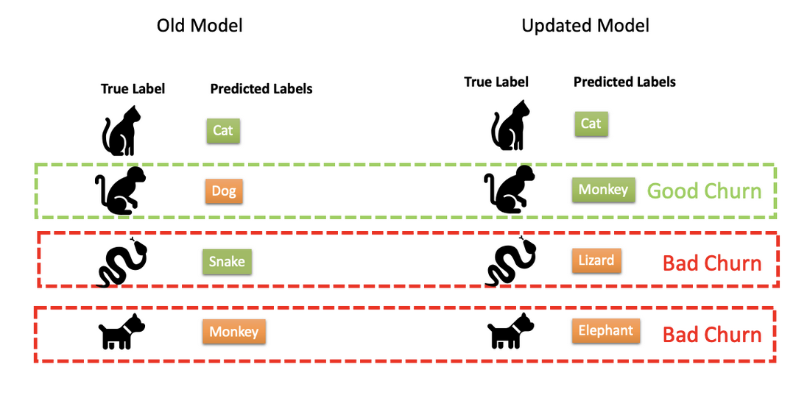

# Prediction Churn Reduction

## Table of Contents
1. [Abstract](#Abstract)
2. [Introduction](#Introduction)  
   2.1 [Proofpoint](#Proofpoint)
3. [Methods](#Methods)  
   3.1 [Overview](#Overview)  
   3.2 [Knowledge Distillation](#Distillation)  
   3.3 [Anchor Method](#Anchor)  
   3.4 [Novel Method](#Novel)
4. [Experiments](#Experiments)  
   4.1. [Experiments: Existing Methods](#Experiments-Existing-Methods)  
      4.1.1. [Experiment setup](#Experiment-setup)  
      4.1.2. [Metrics](#Metrics)    
      4.1.3. [Models](#Models)   
      4.1.4. [Results](#Results)   
   4.2. [Experiments: Novel Method](#Experiments-Novel-Method)  
      4.2.1. [Experiment setup](#Experiment-setup)  
5. [Conclusion](#Conclusion)  
5. [Package](#Package)
6. [Resources](#Resources)  
7. [Contributors](#Contributors)

## Abstract <a name="Abstract"></a>
Machine Learning models deployed in production settings often undergo retraining as and when new data is made available in order to improve accuracy. Sequentially trained models will typically have a certain degree of Prediction Churn in them, which is often undesirable. Prediction Churn is defined as the discrepancy between predictions made by two machine learning models. While prediction churn is a natural occurrence, it can lead to problems for end-users and businesses in the field of Machine Learning and Deep Learning. In this project, we compare and evaluate two existing methods to reduce prediction churn - Anchor and Distillation. We also propose and show that incorporating additional unlabeled data into the distillation or anchor methods can help reduce prediction churn further. Finally, we build develop an open-source python package incorporating the the two existing methods and our novel method.

## Introduction <a name="Introduction"></a>
It is hard to imagine the modern world without machine learning algorithms, which are used ubiquitously in many industries. For instance, banks use predictive algorithms to score their clients and assess risks. IT giants such as Google and Amazon use complex Deep Neural Networks as essential components of their services - Google Translate, Alexa, Google Photos, self-driving cars, and others. As our lives become more digital, cybersecurity becomes more necessary. An extremely flexible tool, machine learning is used in many different contexts, from simple spam filters to sophisticated methods to detect suspicious activity, spotting attacks, and blocking any malicious intent. There are many reasons why machine learning and deep learning are successful in such a dynamic field: automated algorithms are better adapted for rapid changes than heuristic expert-driven approaches, scalability, and it is easier and faster to tune a machine learning algorithm than to develop a brand new set of rules.  

Despite the obvious usefulness of machine learning algorithms, many challenges persist. One such challenge is prediction churn. Prediction churn is the discrepancy between the predictions made by the same model trained on different data samples and is defined as a proportion of mismatched data points to the number of overall predictions. Churn inevitably occurs during the iterative lifecycle of any predictive algorithm. However, mismatches may create many problems for the end users and can be detrimental for businesses that use such algorithms. As an illustration, Google faced backlash when its image classification system first identified photos as trees but then classified them as cars after retraining the model on an extended dataset. In a different context, this undesired behavior could lead to serious negative consequences.  

Prediction churn can be further split into two categories. The first category is desirable or good churn. It happens when an updated model version makes correct predictions in cases where the old model makes mistakes. The second category is undesirable or bad churn. This churn is the most problematic since an updated model makes mistakes in cases where the old model’s predictions are correct. There is another interesting case of bad churn, where both the old model and new model predict incorrectly, but the predictions made by the two have changed. These scenarios are depicted in the visualization below:

 
 Our goal while training the new model is to improve upon accuracy while minimizing undesirable prediction churn.

Despite its significant importance, prediction churn is a highly overlooked research area. However, two broad approaches have been suggested to address prediction churn. The first approach aims to reduces randomness in the training methodology to improve training stability. Sources of randomness in typical machine learning models include initialization, different training runs, choice of hyperparameters, and order of GPU computation. When randomness is reduced, prediction stability increases and prediction churn decreases. However, this approach requires solutions unique to the underlying model type. The second approach frames the problem from a label modification perspective and is model-agnostic. Instead of training on the true labels, the target model trains on a convex combination between hard one-hot encoded labels and soft labels produced by the auxiliary model. All methods we discuss in this paper aim to reduce prediction-churn using the second method. 

### Proofpoint <a name="Proofpoint"></a>
This project was conducted in collaboration with Proofpoint Inc. Proofpoint is an American cybersecurity company whose services require many machine learning models. Such services offer a full range of protection, including cloud accounts, emails, web security, and private data safety.  Given the delicate area in which Proofpoint operates and the large scale of production models, our client faces many challenges, including prediction churn.  

Given the wide variety of machine learning models Proofpoint uses, they are interested in a model-agnostic framework that they can use regularly. There are many different machine learning packages that Proofpoint may use, including PyTorch, TensorFlow, XGBoost, and others. Therefore, we need to develop a label modification solution and interface that Proofpoint may apply to all possible models with the least effort.

## Methods <a name="Methods"></a>

### Overview <a name="Overview"></a>
All methods we look at are of the class of label-modification. The goal in selecting these methods was to identify effective and easy-to-implement methods for reducing prediction churn in machine learning models. The two methods are: Knowledge distillation ([Jiang et al., 2022](#Distillation-ref)) and Anchor ([Cormier et. al., 2016](#Anchor-ref)). There was a third suitable method: Label smoothing ([Bahri et. al., 2021](#LabelSmoothing-ref)). We choose to omit this method due to its inability to treat models as black-boxes.
Firstly, we examine the steps and parameters required to implement each method to reduce churn. We then compare the performance of each method quantitatively using metrics defined in the literature.  
All three methods involve modifying training labels using an older model (referred to as the teacher model). Based on our comparison, we identify two methods that are most effective and continue to develop them further. Specifically, we add additional steps and layers to reduce prediction-churn even lower with the help of available unlabeled data.

### Knowledge Distillation <a name="Distillation"></a>
Developed in 2015, knowledge distillation decreases the complexity of deep learning models by introducing a teacher model. After training a teacher model, a student model, which is usually much simpler, learns from the first model by parroting predictions by using transformed labels for training. In our context, knowledge distillation helps to reduce prediction churn. According to ([Jiang et al., 2022](#Distillation-ref)), knowledge distillation is equivalent under mild assumptions to constraint churn optimization. Since the constraint optimization approach is more involved, churn reduction using distillation is the first candidate for implementation. Label transformation for knowledge distillation is shown in the following equation:  

``` math
\hat{y} = \lambda\times y_{teacher} + (1 - \lambda) \times y_{true}
```

The transformed labels are represented by $`\hat{y}`$, $`y_{teacher}`$ are the predictions of the teacher model taken from the softmax layer, $`y_{true}`$ are one-hot-encoded true labels. Given that there are $`d`$ classes, each vector from the equation belongs to $`\mathbb{R}^{d}`$. Finally, $`\lambda \in [0, 1]`$ is the only hyperparameter for this procedure.

The training loop with knowledge distillation is depicted in the following scheme:


### Anchor Method <a name="Anchor"></a>
To our knowledge the anchor method for churn reduction is one of the first papers on the subject. In our work we use Regress to Corrected Prediction (RCP) operator which is only one of the approaches from the original paper. Anchor RCP method modifies the labels that subsequent models will be trained on using the following equation:  

``` math
\hat{y} = 
\begin{cases}
\alpha\times y_{teacher} + (1 -\alpha) \times y_{true}, \text{when } argmax(y_{teacher}) = argmax(y_{true}) \\
\epsilon \times y_{true}, \text{otherwise} \\
\end{cases}
```

The notation is consistent with the knowledge distillation method. However, anchor RCP method uses two hyperparameters $`\alpha, \epsilon \in [0, 1]`$. Since the original paper is written for binary classification we use a slightly modified approach in our experiments:  

``` math
\hat{y} = 
\begin{cases}
\alpha\times y_{teacher} + (1 -\alpha) \times y_{true}, \text{when } argmax(y_{teacher}) = argmax(y_{true}) \\
\epsilon \times ((1 - \alpha) \times y_{true} + \frac{\alpha}{d}\times \mathbb{1}), \text{where } d \text{ is number of classes and } \mathbb{1} \text{ is a sum vector} \\
\end{cases}
```

The training procedure for anchor RCP method:


### Novel Method <a name="Novel"></a>

Our novel method combines either the anchor or distillation method with an additional layer of unlabeled data classified by the teacher's model. This additional layer generates soft labels that are used in conjunction with the initial and new data to train the student model. This approach can reduce prediction churn even further and may be more effective than using either the anchor or distillation method alone.

Learn more about the rationale behind the efficacy of incorporating unlabeled data by reading about it [here](experiments/Unlabeled_data.md).

The training procedure for novel method:


# Experiments <a name="Experiments"></a>
In this section, we will dive deep into our experimentation process, which involved exploring and testing both existing and novel churn reduction methods.

## Experiments: Existing Methods <a name="Experiments-Existing-Methods"></a>
In this stage, we thoroughly examined the mechanisms and effectiveness of various existing churn reduction methods. We analyzed their strengths and limitations, and tested their performance on our datasets. Through this experimentation, we gained valuable insights into the challenges and opportunities presented by existing methods, and identified potential areas for improvement.

### Experiment setup <a name="Experiment setup"></a>
In order to test churn reduction methods we conducted experiments using textual, tabular, and images data.

### Metrics <a name="Metrics"></a>

Here are five  metrics that can be used to effectively measure the success of these methods. Here, $X$ is the dataset features, $Y$ is the dataset labels, $f_{old}$ is original model, $f_{new}$ is the newly trained model, and $f_{baseline}$ is the newly trained model with no special churn-reduction method applied.

1. Churn $`(f_{old}, f_{new}) = \mathbb{E}_{(X, Y) \sim D}{[\mathbb{1}_{f_{old}(X) \neq f_{new}(X)}]}`$
      * Churn is defined as the expected number of disagreements between two models, i.e., it is the proportion of the labels that the new and the old models disagree upon.

2. ChurnRatio $`(f_{old}, f_{new}, f_{baseline})= \frac{Churn(f_{old}, f_{new})}{Churn(f_{old}, f_{baseline})}`$
      * This is a measure of relative improvement in churn, where a lower ratio indicates that the methodology reduces churn more.

3. GoodChurn $`(f_{old}, f_{new}) = \mathbb{E}_{(X, Y) \sim D}{[\mathbb{1}_{f_{old}(X) \neq Y = f_{new}(X)}]}`$
      * Good Churn is the proportion of data points classified correctly by the new model which were misclassified by the old model.

4. BadChurn $`(f_{old}, f_{new}) = \mathbb{E}_{(X, Y) \sim D}{[\mathbb{1}_{f_{old}(X) \neq f_{new}(X) \neq Y}]}`$
      * Bad Churn is the proportion of data points misclassified by the new model while being different from the classification by the old model.

5. WinLossRatio $`(f_{old}, f_{new}, f_{baseline})= \frac{GoodChurn(f_{old}, f_{new})}{BadChurn(f_{old}, f_{new})}`$
      * Win-Loss Ratio (WLR) captures tradeoff between good churn and bad churn as the ratio between Good Churn and Bad Churn. This is a measure of model performance, where values greater than one indicate the predominance of good churns over bad churns. 

### Models <a name="Models"></a>
- Text: [LSTM](experiments/textual/lstm.py)
- Tabular: [Fully Connected Neural Network](experiments/tabular/models.py)
- Images: [ResNet-18 convolutional neural network](experiments/images/all_in_one.ipynb)

### Results <a name="Results"></a>
The outcomes of our experimentation on existing solutions can be accessed from the following links:
* [Tabular](experiments/tabular/README.md)
* [Images](experiments/images/Readme.md)
* [Text](experiments/textual/README.md)
* [Overall](experiments/First_sem_results.md).

## Experiments: Novel Method <a name="Experiments-Novel-Method"></a>
After conducting extensive research and experimentation on existing solutions aimed at reducing churn, we gained a comprehensive understanding of their underlying mechanisms. This knowledge allowed us to identify potential areas for improvement and spurred us to develop a method that exceeds the capabilities of existing solutions. Our strategy for developing a method involved beginning with a simple model and dataset, rather than immediately delving into complex models and datasets. We carefully evaluated the results of these initial experiments and identified several promising approaches. We then advanced to more sophisticated datasets fine-tuning our model through hyperparameter optimization to attain the optimal results. We ultimately arrived at a method that accomplished our goals.

### Experiment setup <a name="Experiment setup"></a>
To evaluate the effectiveness of the new churn reduction method, we performed experiments using FMNIST dataset. Further information on the data, and results can be found [here](experiments/novel_method/README.md).

# Conclusion <a name="Conclusion"></a>

Our experiment has yielded an alternative method that successfully addresses the issue of churn rate reduction. The results demonstrate the effectiveness of our approach in meeting the stated objectives of the study. Notably, our approach proved to be particularly effective in minimizing bad churn, as opposed to good churn. Moreover, our new approach demonstrated impressive performance in terms of accuracy compared to widely used techniques such as teacher models, anchor/distillation methods, and baseline approaches. These results suggest that our approach holds promising potential for addressing churn-related issues more effectively than existing methods. 
Overall, our study highlights the significance of leveraging novel approaches to address churn-related challenges and emphasizes the potential benefits of our innovative methodology in achieving better outcomes.

There are potential next steps that we can explore in order to advance our approach which is by understanding how unlabeled data sampling strategies can effectively control the rate of good churn. Our plan is to propose a series of experiments using diverse datasets. Through rigorous evaluation of the performance of various sampling strategies, we aim to achieve more effective results. These experiments will involve testing multiple strategies and comparing their effectiveness in controlling the rate of good churn. We will analyze the results to identify the most effective strategies and any positive emerging trends or patterns. Ultimately, our study seeks to provide valuable insights into the efficacy of unlabeled data sampling strategies in controlling the rate of good churn and reduction of bad churn.

## Package <a name="Package"></a>

We have implemented anchor and knowledge distillation methods. The python package can be installed by using the command:

```shell
pip install ./dist/churn_reduction-0.0.1-py3-none-any.whl 
```

The package source code is located in ./src/churn folder.

## Resources <a name="Resources"></a>
1. [Heinrich Jiang, Harikrishna Narasimhan, Dara Bahri, Andrew Cotter, Afshin Rostamizadeh. Churn Reduction via Distillation. *arXiv preprint arXiv: 2106.0265v2, 2022*](https://arxiv.org/pdf/2106.02654.pdf)<a name="Distillation-ref"></a>
2. [Q. Cormier, M. Milani Fard, K. Canini, M. R. Gupta. Launch and Iterate: Reducing Prediction Churn. *30th Conference on Neural Information Processing Systems (NIPS 2016)*](https://papers.nips.cc/paper/2016/file/dc5c768b5dc76a084531934b34601977-Paper.pdf)<a name="Anchor-ref"></a>
3. [Dara Bahri, Heinrich Jiang. Locally Adaptive Label Smoothing for Predictive Churn. *arXiv preprint arXiv: 2102.05140v2, 2021*](https://arxiv.org/pdf/2102.05140.pdf)<a name="LabelSmoothing-ref"></a>
4. [Kenneth Borup. Knowledge Distillation - Keras implementation. *keras.io, 2020*](https://keras.io/examples/vision/knowledge_distillation/)

## Contributors <a name="Contributors"></a>
[Dauren Bizhanov](https://linkedin.com/in/dauren-bizhanov)  
[Himangshu raj Bhantana](https://linkedin.com/in/himangshu-bhantana)  
[Satvik Kishore](https://linkedin.com/in/satvik-kishore)  
[Tigran Harutyunyan](https://linkedin/in/tigran-harutyunyan)  
