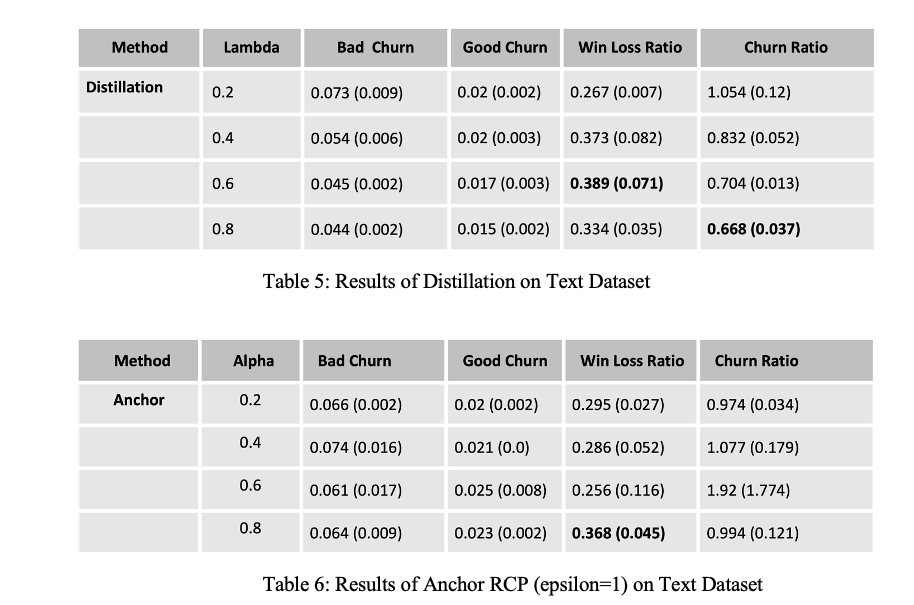

### Results

In this section, we are going to present the results of experiments carried out exclusively by existing distillation and anchoring methods.

 

Tables 1 and 2 show results from using Tabular Online News Popularity dataset using the Distillation and Anchor method respectively. The accuracy of the model appears to be invariant of the choice of churn reduction method. However, we do see changes in the churn metrics. Bad Churn, Good Churn, and Churn Ratio decrease with increase in Lambda and Alpha. This is because increasing these parameters pushes the model to learn more from the teacher model. Amongst the key metrics, Churn Ratio is minimized using Knowledge distillation with lambda = 0.8. Thus we see knowledge distillation outperform the anchor method. In WLR, we observe that it is maximized on intermediate values of Lambda and Alpha. This is because too low Lambda/Alpha pushes the model to learn more from original labels, and thus there will be a significant amount of bad churn. When these parameters are too high, the model does not learn too much new information and thus the good churn is too low to cause a rise in WLR. Win Loss Ratio was maximized in Knowledge Distillation with lambda=0.6.  

 

Tables 3 and 4 show results from the CIFAR-10 image dataset. Here, once again, we see that accuracy does not change much from change in Alpha/Lambda. We see that knowledge distillation significantly outperforms the anchor method, both on WLR and on Churn Ratio. Churn Ratio is minimized at higher lambda (lambda=0.8), whereas WLR is maximized at intermediate values of Lambda (lambda=0.4). One theory on why distillation performs much better is that the distillation method was specifically developed and tested on neural networks with multi-class classification objectives, whereas the Anchor method was developed for machine learning methods in general, primarily for binary classification. 

 

Tables 5 and 6 show results from the text dataset. Once again, distillation with high lambda performs best in reducing churn ratio. Similarly, within distillation, win loss ratio is minimized on an intermediate value of lambda=0.6. The anchor method fails to reduce churn ratio in this case. The behavior on win loss ratio is also different, with it being maximized on alpha=0.8. More investigation will be needed to understand why the anchor does not perform as expected here. The appendix contains more detailed results with a larger choice of hyperparameters.

These results lead us to believe that going forward, knowledge distillation should be the preferred method of choice for reducing churn. Development of a novel approach to reducing churn warrants understanding what the distillation method does well that the anchor method does not. A caveat is that our experiments were fairly restricted in scope and were not exhaustive by any means. Additionally, given that distillation does not significantly outperform anchor in the tabular binary classification task implies that we cannot generalize our results to conclude that distillation is always better than anchor. 
