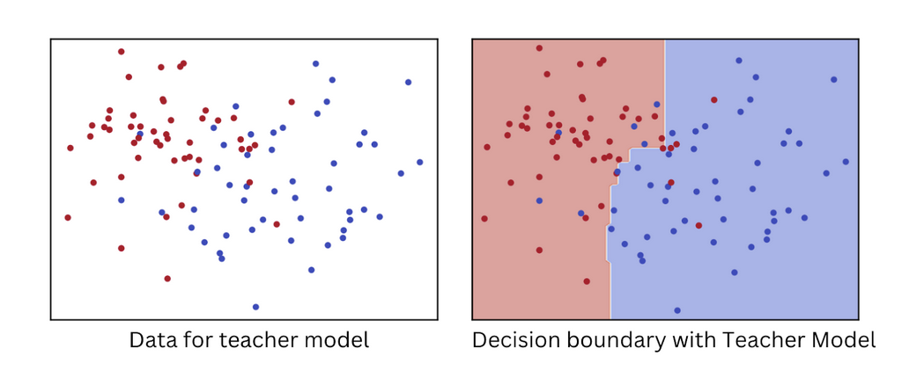
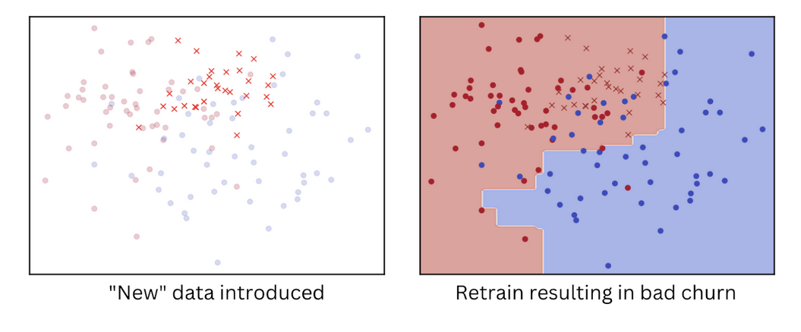
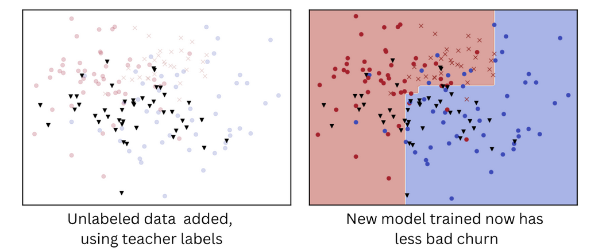

# The Role of Adding Unlabeled Data

Although unlabeled data lacks explicit class information, it can provide additional context and structure that can help models better understand the underlying patterns and relationships in the data. The use of unlabelled data in our approach was intended to enhance the performance of our model by capitalizing on the knowledge of the teacher model. By utilizing the teacher model to classify the unlabelled data, we generated more training data for the student model, which led to improved performance. This technique takes advantage of the teacher model's knowledge to direct the student model's learning, allowing it to better generalize to new data.
Let us delve into the intricacies of the process by taking a detailed, step-by-step approach to how we make use of unlabelled data on our end. For illustration purposes, let's assume that we have two classes, namely red and blue, and we have our first model, which we shall refer to as the teacher model. Once we plot the distribution of these classes, we can see a clear and distinct boundary between the two classes.

Now, let's introduce new data to the model and observe how it performs. After retraining the model with the new data, we plot the decision boundary again and observe that the boundary shifts near the new data, but unexpectedly it also shifts away from the new data. This is an undesired effect that did not happen with our initial model. We can refer to this unnecessary stretching of the decision boundary as churn, which is undesirable since it negatively impacts the model's ability to accurately classify new data.

To address this issue, we use the teacher model to make predictions on the unlabeled data. We then combine with the old data and retrain the model. By doing so, we solve the issue where the model only behaved well near the new data and not further away. When we plot the decision boundary of this new model, we can observe a clear and distinct boundary once again.

