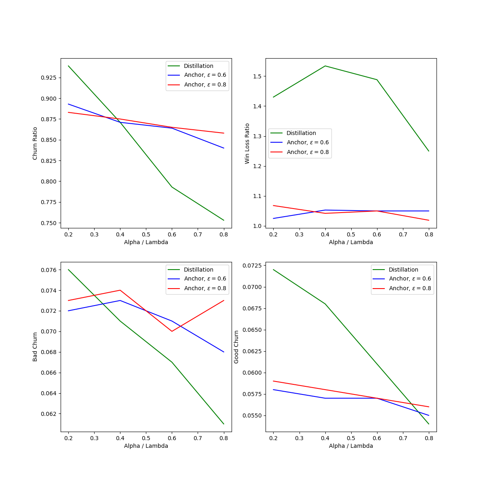

# Image data experiments

### Run
The experiment has to be run with the following [notebook](../../experiments/images/all_in_one.ipynb)

### Data
The data set used in this experiment: [CIFAR-10](https://www.cs.toronto.edu/~kriz/cifar.html)

The CIFAR-10 dataset consists of 60000 32x32 color images in 10 classes, with 6000 images per class.

To conduct our experiment, we divided our dataset into several subsets for training, validation, and testing. Here is how we broke down the data:
| Dataset          | Classes | Train + Val Size | Test Size | Old Model Train Size | New Model Train Size | Validation Size |
|------------------|---------|-----------------|-----------|----------------------|----------------------|-----------------|
| Cifar10          | 10      | 50000           | 10000     | 30000                | 40000                | 10000           | 

### Performance comparison
The result of the experiments on the image data with distillation averaged across 10 runs:

| Lamda | Churn Ratio | Good Churn | Bad Churn | Win Loss Ratio |
|-------|-------------|------------|-----------|----------------|
| 0.2   | 0.939 (0.03)| 0.072 (0.01)| 0.076 (0.01)| 1.43 (0.19)    |
| 0.4   | 0.871 (0.03)| 0.068 (0.0) | 0.071 (0.01)| 1.534 (0.16)   |
| 0.6   | 0.793 (0.02)| 0.061 (0.0) | 0.067 (0.0) | 1.488 (0.15)   |
| 0.8   | 0.753 (0.02)| 0.054 (0.0) | 0.061 (0.0) | 1.25 (0.15)    |

The result of the experiments on the image data with anchor averaged across 10 runs:

| Alpha | Epsilon | Churn Ratio | Good Churn | Bad Churn | Win Loss Ratio |
|-------|---------|-------------|------------|-----------|----------------|
| 0.2   | 0.6     | 0.893 (0.04)| 0.058 (0.0)| 0.072 (0.0)| 1.025 (0.14)    |
| 0.2   | 0.8     | 0.883 (0.03)| 0.059 (0.0)| 0.073 (0.01)| 1.068 (0.13)    |
| 0.4   | 0.6     | 0.871 (0.04)| 0.057 (0.0)| 0.073 (0.0)| 1.053 (0.12)    |
| 0.4   | 0.8     | 0.875 (0.03)| 0.058 (0.0)| 0.074 (0.01)| 1.042 (0.07)    |
| 0.6   | 0.6     | 0.864 (0.03)| 0.057 (0.0)| 0.071 (0.01)| 1.056 (0.1)     |
| 0.6   | 0.8     | 0.865 (0.04)| 0.057 (0.0)| 0.07 (0.0)  | 1.052 (0.1)     |
| 0.8   | 0.6     | 0.84 (0.03) | 0.055 (0.0)| 0.068 (0.0)| 1.053 (0.1)     |
| 0.8   | 0.8     | 0.858 (0.03)| 0.056 (0.0)| 0.073 (0.01)| 1.019 (0.08)    |

