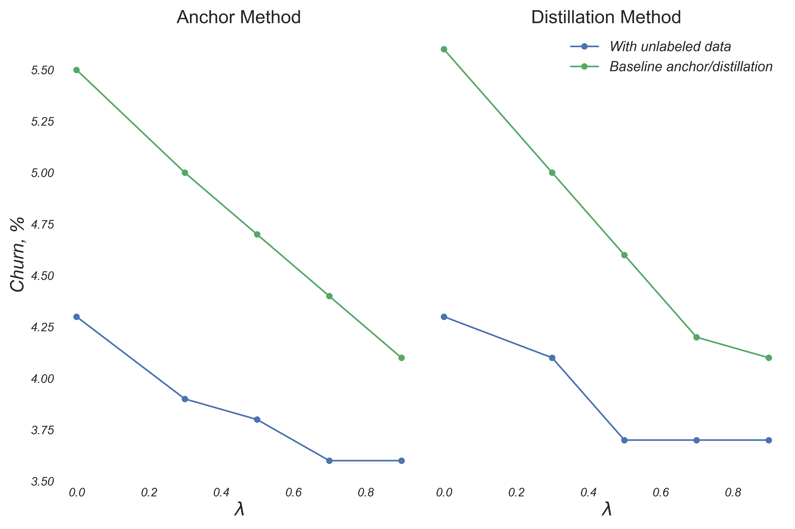
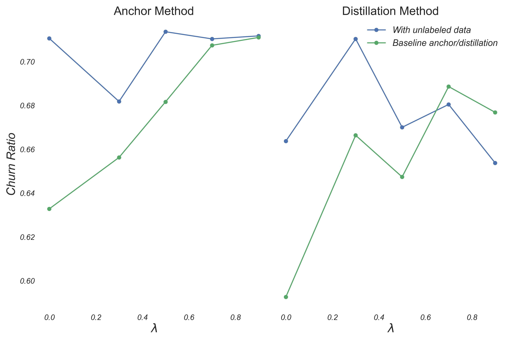
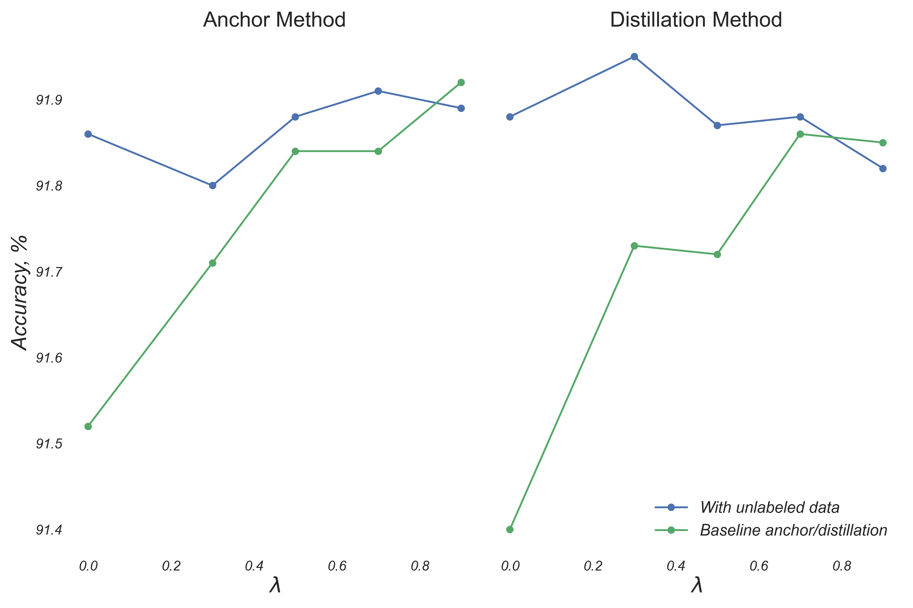

### Data

The dataset we utilized for our experiments is The Fashion-MNIST dataset (Xiao, Rasul, & Vollgraf, 2017), which comprises 70,000 grayscale images of 28x28 pixels. The images are categorized into 10 classes, representing different types of clothing and accessory items. We applied the same preprocessing steps as the original MNIST dataset (LeCun et al., 1998). For this experiment, we chose three classes randomly to serve as the source of "new data," while all ten classes were used for "training," "validation," and "unlabeled" data. The distribution of the dataset per class is as follows:

|                | Classes: 0,1,2,4,6,8,9 | Classes: 3,5,7 |
|----------------|------------------------|----------------|
| Training set   | 4400                   | 3900           |
| Testing set    | 800                    | 800            |
| Validation set | 800                    | 800            |
| Unlabeled set  | 1000                   | 500            |
| New set        | 0                      | 1000           |

To start the experiment, we trained a teacher model using the initial dataset. We then utilized the teacher model to generate soft labels for the unlabeled dataset. Following that, we trained a student model using either the anchor or distillation method to modify the labels of both the initial and new datasets, while also incorporating the unlabeled data with soft labels.

We conducted experiments with various methods for selecting the unlabeled data to be used, but we did not observe any significant differences in performance. Therefore, we randomly selected the unlabeled data and did not include the results of those experiments.

We also conducted experiments to determine the optimal number of unlabeled data samples to be used, but due to the limited size of the dataset, we decided to prioritize having a sufficient number of data points to train the teacher model effectively.

1. [Experiment of Novel Method with Distillation](/notebooks/second_semester/Unlabeled_novelmethod_dist_v8.ipynb)
2. [Experiment of Novel Method with Anchor](/notebooks/second_semester/Unlabeled_novelmethod_anchor_v8.ipynb)

### Results

The results of our experiments showed that the novel method we proposed was able to achieve a significant reduction in the overall churn rate compared to the currently available distillation and anchor methods. This was demonstrated by the data presented in Figure 1. 

<figure align="left">
 
<figcaption><em>Figure 1. Overall Churn</em></figcaption>
</figure>

Furthermore, the results shown in Figure 2 indicate that our proposed method achieved a lower overall churn rate while also maintaining a higher ratio of good churn to bad churn compared to the distillation and anchor methods. This suggests that our approach reduces churn predictions while allowing for the student model to perform better than the teacher model to some extent.

<figure align="left">

<figcaption><em>Figure 2. Churn Ratio</em></figcaption>
</figure>

One more achievement of our experiment is that we were able to maintain a comparable level of model accuracy while achieving a lower overall churn rate and a higher good churn/bad churn ratio with our novel method. This can be observed in Figure 3.

<figure align="left">

<figcaption><em>Figure 3. Accuracy</em></figcaption>
</figure>

The figures presented in this study were based on the overall results of the experiments outlined in Table 1.

| lambda | model_type   | accuracy novel | bad churn novel | churn ratio novel | good churn novel | accuracy baseline RCP/Distillation | bad churn baseline RCP/Distillation | churn ratio baseline RCP/Distillation | good churn baseline RCP/Distillation | accuracy baseline no procedure | bad churn baseline no procedure | churn ratio baseline no procedure | good churn baseline no procedure | overall churn novel | overall churn baseline no procedure | overall churn baseline RCP |
|:-------|:-------------|:---------------|:----------------|:------------------|:-----------------|:-----------------------------------|:------------------------------------|:--------------------------------------|:-------------------------------------|:-------------------------------|:--------------------------------|:----------------------------------|:---------------------------------|:--------------------|:------------------------------------|:---------------------------|
| 0.0    | Anchor       | 91.86          | 201.8           | 0.71              | 143.4            | 91.52                              | 271.8                               | 0.63                                  | 172.0                                | 91.46                          | 277.4                           | 0.61                              | 171.0                            | 4.3                 | 5.6                                 | 5.5                        |
| 0.3    | Anchor       | 91.80          | 184.8           | 0.68              | 126.0            | 91.71                              | 243.8                               | 0.65                                  | 160.0                                | 91.46                          | 277.4                           | 0.61                              | 171.0                            | 3.9                 | 5.6                                 | 5.0                        |
| 0.5    | Anchor       | 91.88          | 177.4           | 0.71              | 126.6            | 91.84                              | 222.4                               | 0.68                                  | 151.6                                | 91.46                          | 277.4                           | 0.61                              | 171.0                            | 3.8                 | 5.6                                 | 4.7                        |
| 0.7    | Anchor       | 91.91          | 167.8           | 0.71              | 119.2            | 91.84                              | 204.4                               | 0.70                                  | 144.6                                | 91.46                          | 277.4                           | 0.61                              | 171.0                            | 3.6                 | 5.6                                 | 4.4                        |
| 0.9    | Anchor       | 91.89          | 168.6           | 0.71              | 120.0            | 91.92                              | 193.8                               | 0.71                                  | 137.8                                | 91.46                          | 277.4                           | 0.61                              | 171.0                            | 3.6                 | 5.6                                 | 4.1                        |
| 0.0    | Distillation | 91.88          | 205.2           | 0.66              | 136.2            | 91.40                              | 281.8                               | 0.59                                  | 167.0                                | 91.49                          | 269.6                           | 0.59                              | 161.4                            | 4.3                 | 5.4                                 | 5.6                        |
| 0.3    | Distillation | 91.95          | 190.6           | 0.71              | 135.4            | 91.73                              | 238.0                               | 0.66                                  | 158.6                                | 91.49                          | 269.6                           | 0.59                              | 161.4                            | 4.1                 | 5.4                                 | 5.0                        |
| 0.5    | Distillation | 91.87          | 178.2           | 0.67              | 119.4            | 91.72                              | 221.2                               | 0.64                                  | 143.2                                | 91.49                          | 269.6                           | 0.59                              | 161.4                            | 3.7                 | 5.4                                 | 4.6                        |
| 0.7    | Distillation | 91.88          | 174.0           | 0.68              | 118.4            | 91.86                              | 200.4                               | 0.68                                  | 138.0                                | 91.49                          | 269.6                           | 0.59                              | 161.4                            | 3.7                 | 5.4                                 | 4.2                        |
| 0.9    | Distillation | 91.82          | 180.8           | 0.65              | 118.2            | 91.85                              | 196.2                               | 0.67                                  | 132.8                                | 91.49                          | 269.6                           | 0.59                              | 161.4                            | 3.7                 | 5.4                                 | 4.1                        |

<b><em>Table 1. Averaged results across 5 experiments.</em></b>
