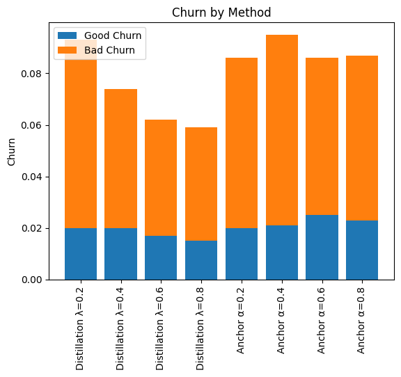
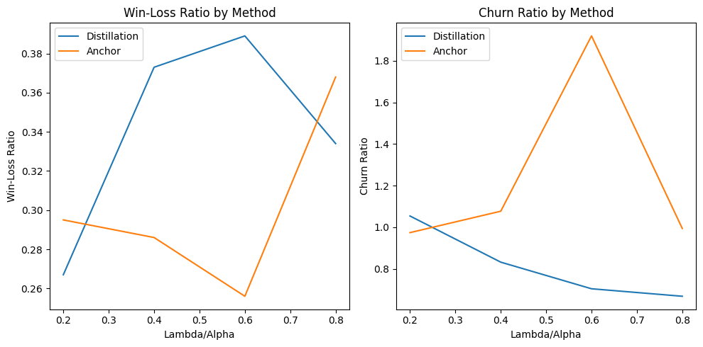

# Text data experiments

### Data
The data set used in this experiment: [Large Movie Review Dataset](https://ai.stanford.edu/~amaas/data/sentiment/).

### Run

The experiment has to be run with the following [notebook](../../notebooks/exp_text_data.ipynb)

### Structure
1. load_data_train_split.py - Load the dataset
2. build_vocab.py - build a vocabulary based on the training corpus.
3. tokenizer.py - Tokenize the give example string into a list of token indices.
4. hparams.py - Constance hyperparameters for training the model
5. lstm.py - model used in the experiments: LSTM.
6. predict_sentiment - function to make prediction per review
7. predict_batch.py - prediction in batches
8. train_val.py - train and do validation and save the best results with metrics
9. anchor.py - function for anchor method
10. distillation.py - function for distillation method
11. label_smoothing.py - function for label_smoothing method

### Performance comparison
The result of the experiments on the tabular data averaged across 7 runs:

| Method       | Hyperparameters    | Good Churn | Bad Churn | Win-Loss Ratio | Churn Ratio |
|--------------|--------------------|------------|-----------|----------------|-------------|
| Distillation | lambda=0.2         | 0.020      | 0.073     | 0.267          | 1.054       |
| Distillation | lambda=0.4         | 0.020      | 0.054     | 0.373          | 0.832       |
| Distillation | lambda=0.6         | 0.017      | 0.045     | 0.389          | 0.704       |
| Distillation | lambda=0.8         | 0.015      | 0.044     | 0.334          | 0.668       |
| Anchor       | alpha=0.2, eps=1.0 | 0.020      | 0.066     | 0.295          | 0.974       |
| Anchor       | alpha=0.4, eps=1.0 | 0.021      | 0.074     | 0.286          | 1.077       |
| Anchor       | alpha=0.6, eps=1.0 | 0.025      | 0.061     | 0.256          | 1.920       |
| Anchor       | alpha=0.8, eps=1.0 | 0.023      | 0.064     | 0.368          | 0.994       |

